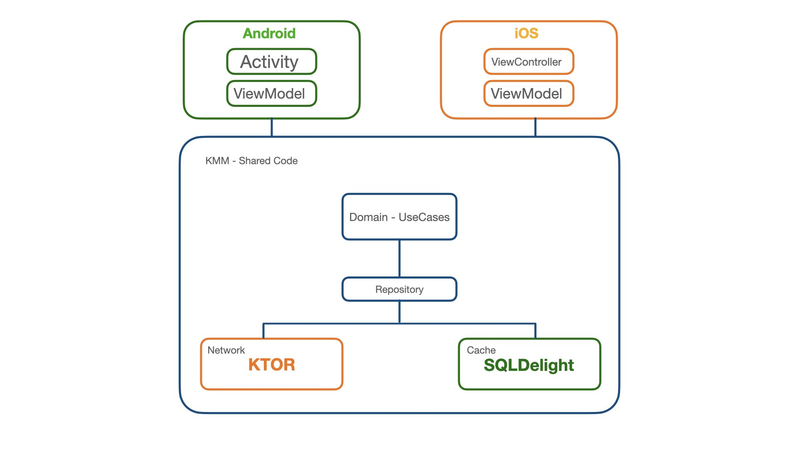

# Simple architecture (based on clean architecture) with Kotlin Multiplatform mobile

This repository is the code corresponding to the hands-on lab [Networking and data storage with Kotlin Multiplatform Mobile](https://play.kotlinlang.org/hands-on/Networking%20and%20Data%20Storage%20with%20Kotlin%20Multiplatfrom%20Mobile/01_Introduction).
I made some changes in the architecture / application packaging. I have integrated the domain layer. Below is a drawing of the architecture.

The entire application will be updated with the integration of Dependency Injections.
